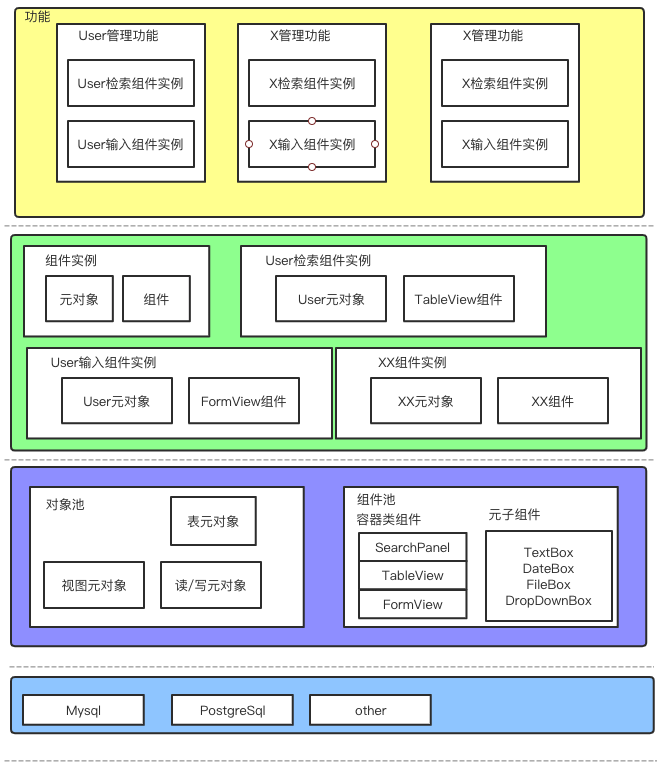
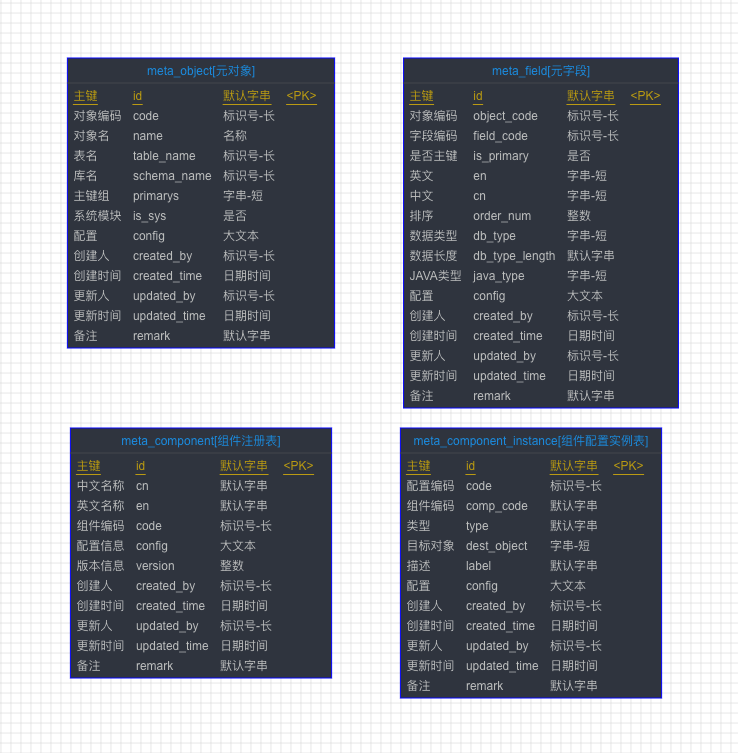
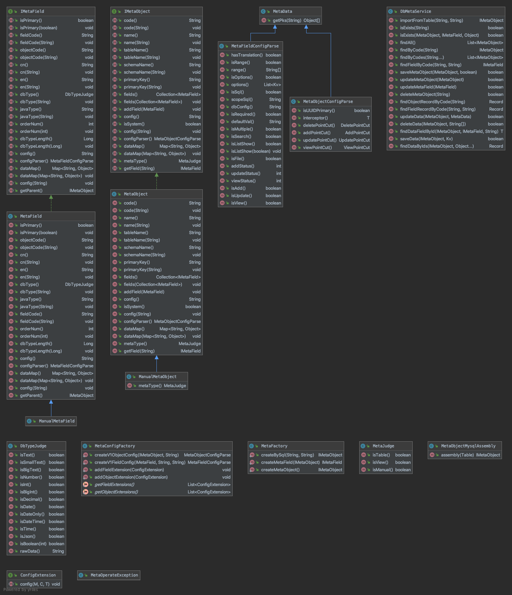
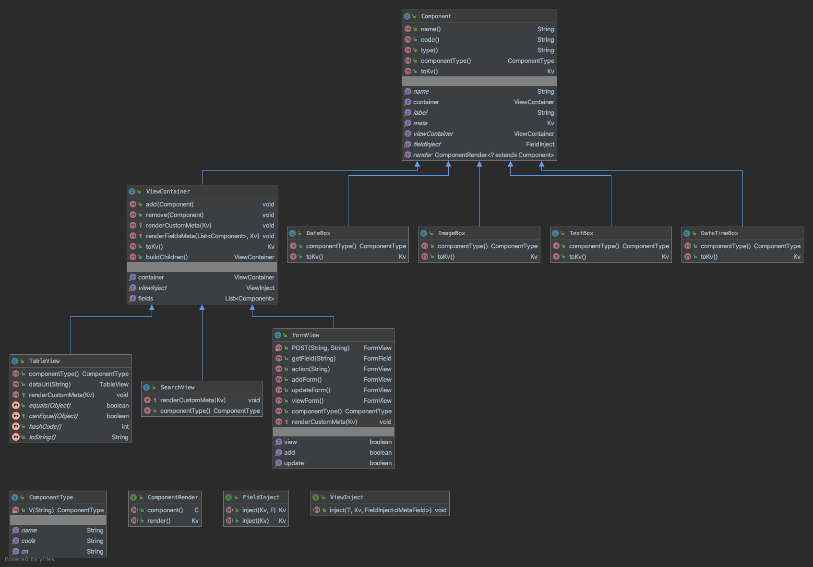
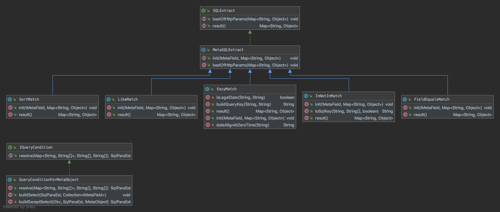
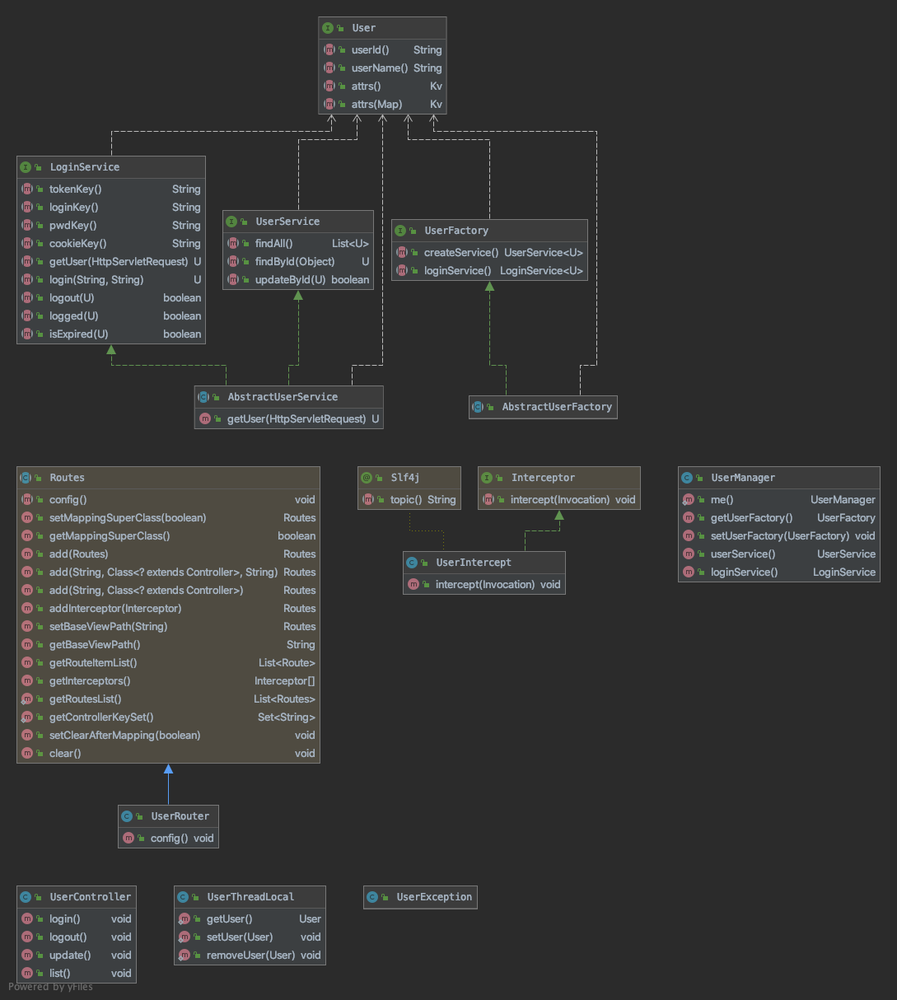
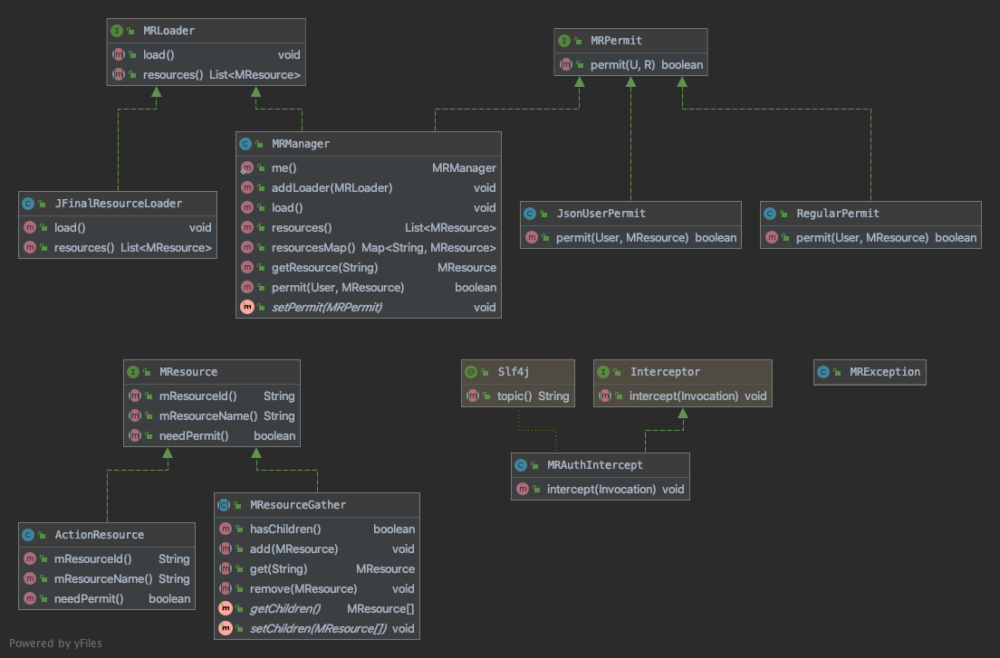

# db-metadata-serve
> 工程的缩写DBMS 与数据库的那个DBMSDBMS Database Management System）有区别，但本质又相近。（工程名字并没有仔细推敲过，主要想做一个解决crud和常规业务场景的一个引擎
## 介绍
>我对于快速开发框架和快速开发平台的定义,一个具备基本开发工具的整合后框架,同时具备一些基本的模块(RBAC权限,菜单,用户,字典等)的脚手架.这些框架的初衷都是想
>让开发人员不必在重头搭建一套完备的系统后,才开始开发和自己业务相关的模块,尽可能把"公共"模块抽离,达到复用
>
>但现状是一个大型项目,或者系统中通常有很多子系统或子模块组成,并不是每个子模块都要具有完整的用户权限、登录、菜单管理、字典等等功能。
>如果是在人员有限、项目规模不大、并且是从0->1这个阶段开始的话，选择任何一个开源的快速开发框架都是合适的，如果系统非0->1这个阶段，已经上线且具备一些功能了，再引入快速开发框架的意义就不是很大了
>
>DMBS 的定位首先是一套功能引擎,其次才是开发平台
#### 市面上一些主流的快速开发平台
> 社区相对活跃,功能完备,技术栈新的
- [jeesite - https://jeesite.gitee.io/](https://jeesite.gitee.io/) - [演示地址](http://demo.jeesite.com/)
- [jeecg - http://www.jeecg.com/](http://www.jeecg.com/)- [演示地址](http://boot.jeecg.com/)
- [eova - http://www.eova.cn/](http://www.eova.cn/) - [演示地址](http://pro.eova.cn/)

### 技术栈
- JFinal
- Mysql 5.7 / Druid 
- Jdk1.8
- Guava
- FastJson
### 能干什么
- 迅速构建一个CRUD模块
- 各类模板配置 
    - 主子表   
    - 单表
    - 树表
- 图形样式设计
- 天然支持分布式应用
- 可当纯后端提供数据接口
- 可前后端一起使用
- springboot支持

## 快速开始
### 工程结构
```bash
├── arthas-output
├── db                          # 数据库文件
├── db-metadata-analysis        # 元数据分析工程,元对象的构建,基于元对象的操作
├── db-metadata-parent          # Maven Root工程
├── db-metadata-web-iview       # 前端工程 使用ElementUI，为了保留git提交记录，暂未将iview更名
├── db-metadata-web-jfinal      # 服务端工程
│   └── src
├── jfinal-spring-boot-demo     # springboot-jfinal 整合 demo
│   ├── src
│   └── target
└── jfinal-spring-boot-starter  # springboot-jfinal- start
    ├── src
    └── target

```
### 安装部署
### 依赖配置
### 集成

## 用户文档

### 基础术语
#### 元对象
>《Thinking in Java》开篇就写到“一切皆对象”，Linux世界中“一切皆文件”，在DBMS中可以理解成一切的一切都离不开“元对象”；
什么是元对象，“元数据”是描述数据的数据，那么元对象就是描述对象的对象,狭隘的理解，一个元对象可以代表一个“表”，“一个视图”


#### 元子段
#### Component
> 组件的抽象是为了服务与前端的展示，每一个前端框架种组件都可以抽象为一个组件
```
- 数据展示(ViewComponent)
    - 表格组件(依赖元对象)(TableView)
    - 表单组件(依赖元对象)
    - 树型组件(依赖元对象)
    - 搜索组件(依赖元对象)(简单的可以使用穿梭框)
- 表单(FormView)
    - 单选组件(元子段)FormField
    - 多选组件(元子段)
    - 输入组件(元子段)
    - 业务查询组件
    - 开关组件(元子段)
    - 日期组件(元子段)
    - 范围组件(元子段)
    - 上传组件(元子段)
```
#### Component实例
> 单纯的组件是没有灵魂的，元对象和元字段是组件的数据灵魂
#### 模板
什么是模板，模板是各种前端组件的集合,模板不能直接使用，模板硬编码编辑
#### 功能
> 功能可以是一个按钮+背后的逻辑  
> 功能可以是一个纯背后的逻辑  
> 功能可以是一个页面  
> 公式:
```
功能 = (SearchBar(Component) + UIConfig + 元对象) * n
功能 = Table(Component) + UIConfig + 元对象
功能 = 功能 * n
```


### 架构设计

#### 总体架构图
> 元对象,元子段,component等概念的层次结构,对应关系 

#### 通信图
> 前端请求渲染-> 后端数据装配->配置载入->merge
#### 数据库E-R图

#### 元对象-类图

#### Component-类图

#### Query模块

#### 扩展
> 为了能更好的融入其他系统，DBMS对常见的模块做了抽象，用少量的接口保证足够的灵活性
##### 用户体系
> 用户体系单独拎出可以作为一个庞大的子系统来开发，在DBMS种对用户做了一定抽象

> 核心接口 User(用户实体接口)，LoginService（登录服务），UserService（用户查询服务）,UserFactory(工厂)

##### 权限体系
>DBMS并未实现RBAC之列的权限控制模块，而是留了扩展接口

>DBMS种权限核心接口是MResource(资源)，MRPermit(资源判定器),MRLoader(资源加载器)


### 核心数据结构

#### 前端
```
 
```

## 技术债务
- 系统为了获得动态能力,同时为了快速上线第一个版,底层采用了json存储配置,导致了上层数据搬运时不得不大量使用Kv对象(Map),调用链过长时很难确认当前Kv对象内部的数据
为代码阅读和调试带来了成本和风险
    > 在数据结构稳定后,关键的配置使用具体的模型来存放
- DB上配置信息存放在json字段,虽保证了灵活度,但是不利于检索,Mysql5.7对于Json字段的支持有限
- 元对象config,字段config,component.config,实例config,为了做到各层独立,分别设置了不同作用,不同意义的配置信息.在开始接触的时候对于这些
配置信息需要消化的成本太高,而且config未做结构校验,很可能在功能大面积爆发时出现无用无效的脏字段
- 

## RoadMap
- server 源代码方式集成,剥离db-metadata-server业务逻辑和容器有关的逻辑,目的为了上层使用其他mvc框架做支持;
- 数据权限的设计
    > 以元对象为基础,配合自定义的模板脚本片段,生成带有权限过滤内容的sql,以此来做数据权限
    ```
        模板片段可以内置类似User,Group,Company等对象
        权限判断可能是
        if(user.role.is('组长'))
            return Query,Add,Update
        if(user.role.is('小弟'))
            return Query
        查看小组下的数据可能是
        if(user.role.is('组长')&&user.role.has(query))
            return create_by in GroupIds
        
    ```
- 丰富MResource的实现，增加不同纬度的验证（元对象纬度，模板纬度）,对Query模块的查询权限进行控制
- 丰富对数据库视图支持ViewMetaObject,增加元对象属性设定,参考linux文件系统drwxrwxrwx
- formbuilder 覆盖常用模板
- Jsondiff的支持
- springboot 深度集成(用spring完全接管datasource),充分支持spring方式创建router,controller,intercepter等jfinal组件
- 耗时操作的缓存支持(ehcache+redis)
- 对"功能"做版本控制,因功能渲染完全依靠数据配置,必须要保证发布后版本可控,目前元对象配置更新过以后,上游所有组件config会重新计算;
- 目前表单仅支持单个元对象,复杂业务场景可能有同时编辑多张表的需求
- 完善对spring容器的支持,目前还只是初步集成;
## 原则

- 做一切有利于"快"的需求
- 解决一类问题,而不是一个问题
- 拒绝头疼医头,脚疼医脚

## 约定

## 设计参考

- Eova ,jeesite,jeecgboot,普元
- Extjs,vue component